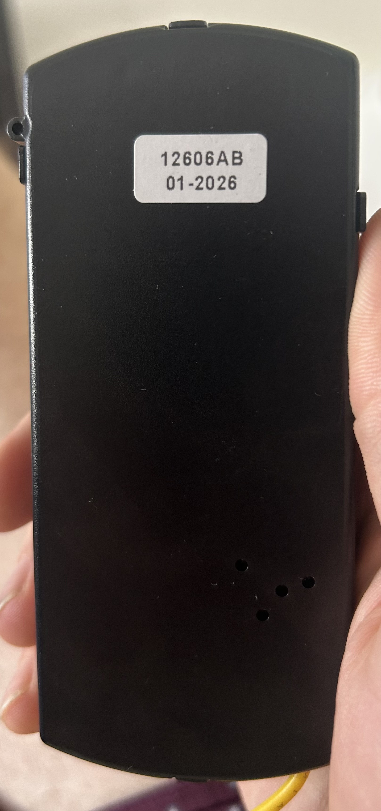
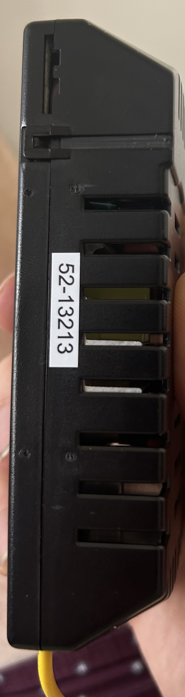
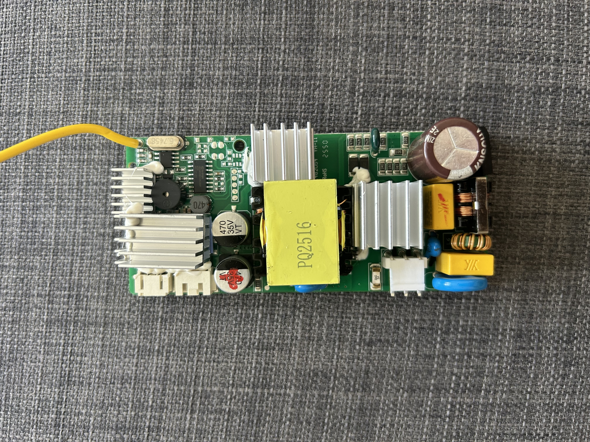
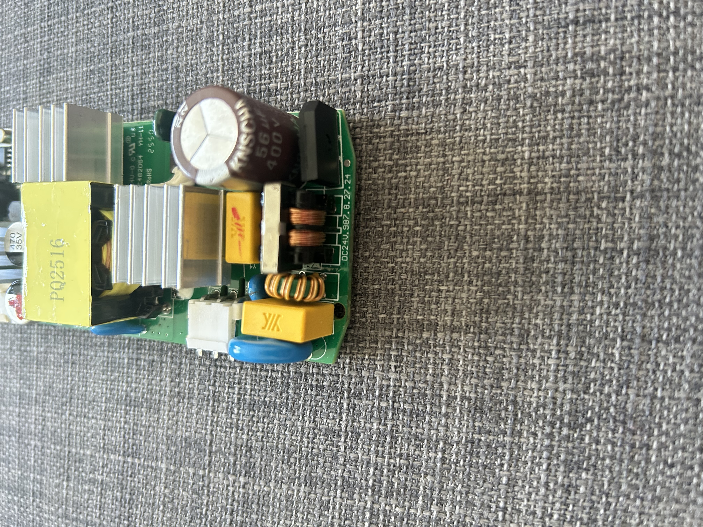
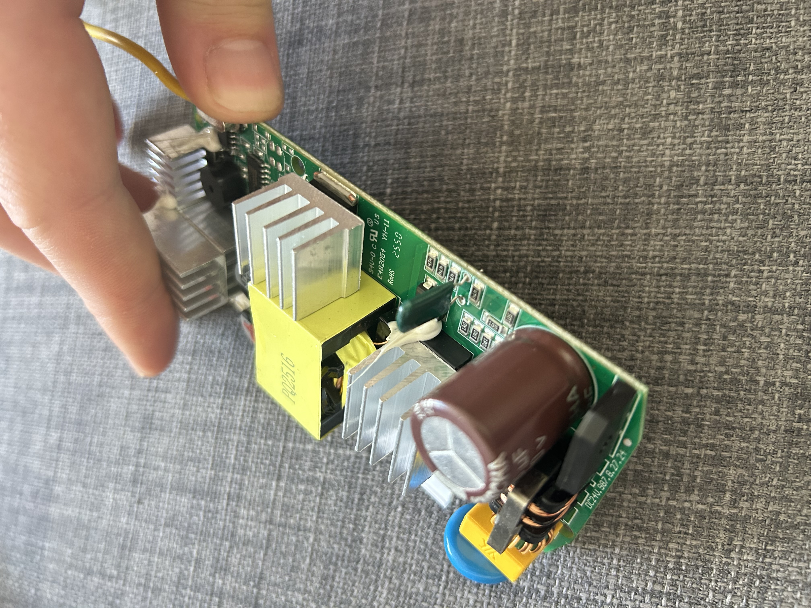
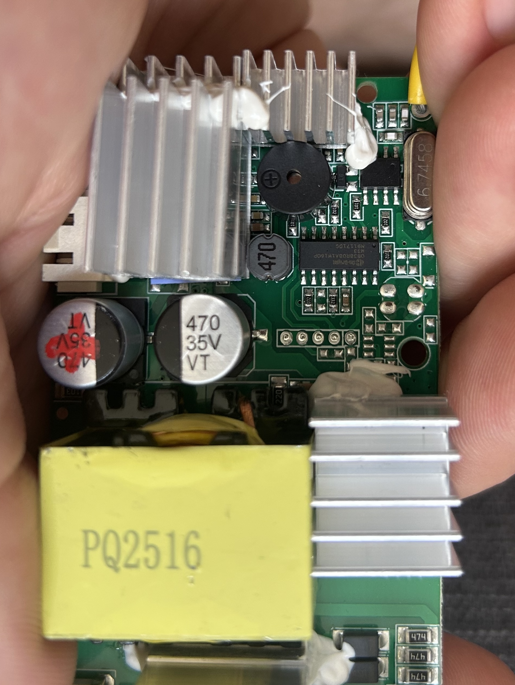
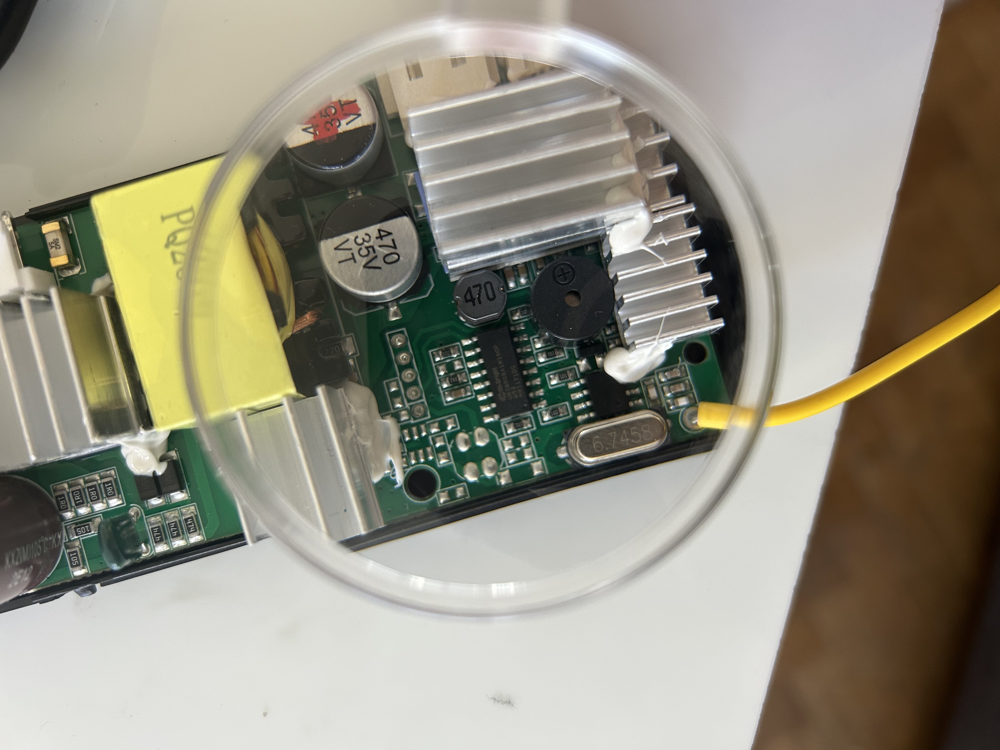
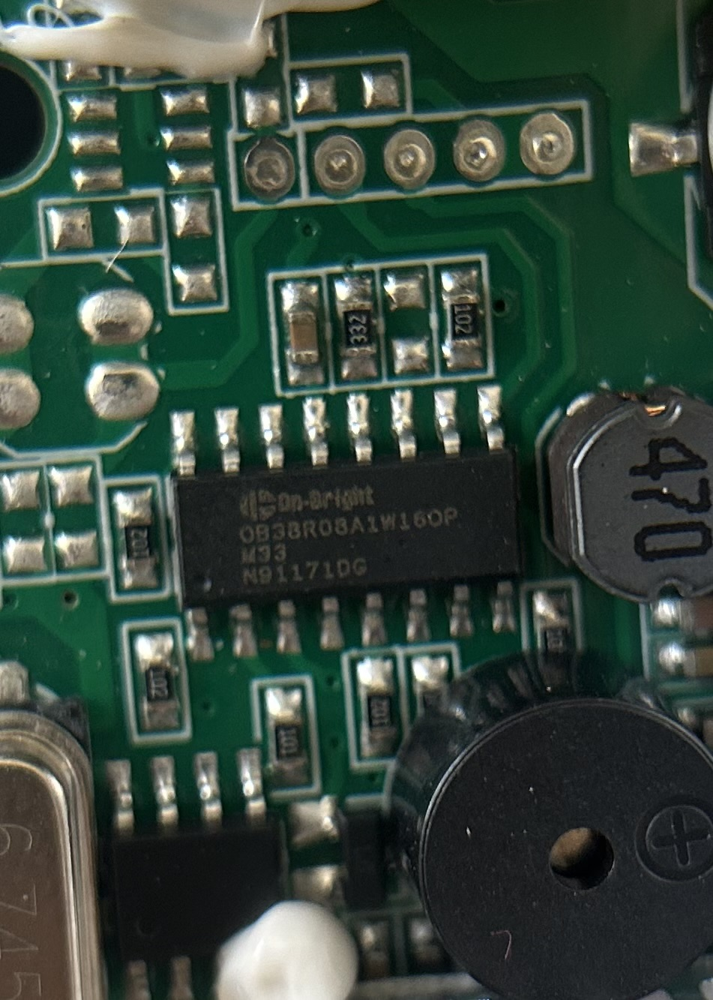
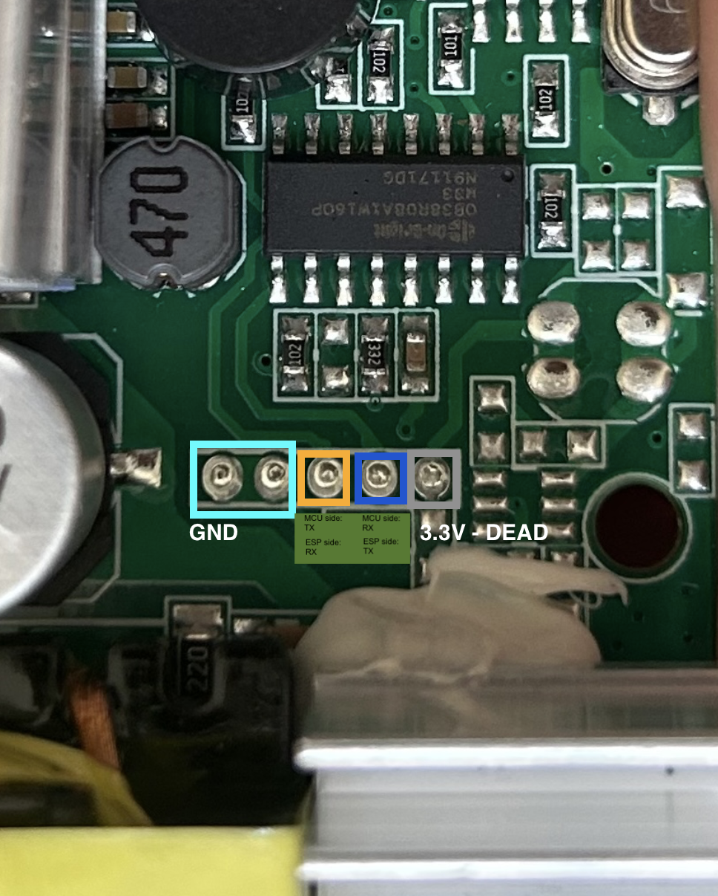

# Rohnson R-8152 ceiling fan + light — ESPHome / Tuya-MCU bridge

This is an [ESPHome](https://esphome.io/) configuration that adds ESP into the place where should be the
stock WiFi module of a **Rohnson R-8152** ceiling fan (with integrated CCT
light) with a generic **ESP32-C3 Super Mini**, while still talking to the
fan's original Tuya-protocol MCU over UART. The result is full local control
from Home Assistant — fan on/off, 6-speed, direction, light on/off,
brightness, and 3-position color temperature — exposed as clean, native HA
entities, with no cloud dependency.

> This whole repo — the protocol reverse-engineering, the custom component,
> and this README — was vibecoded with Claude Code. If you've got a Rohnson
> R-8152 (or a board that looks like the one in the photos below) and find
> anything else out about it — different datapoint behavior, a working
> fix for the "All Off" limitation, a way how to disable the peizo buzzer, anything — I'm happy to incorporate it
> here. Open an issue or a PR.

## Hardware

The Rohnson R-8152's main control board has an **unpopulated footprint**
clearly intended for an OEM Tuya WiFi module — 5 pads (TX, RX, two GND, and
3.3V) laid out in the usual Tuya module pattern — that the manufacturer
left off this SKU. An ESP32-C3 Super Mini was wired directly into that
footprint instead of the missing Tuya module.

**The 3.3V rail on that footprint is dead** — there's no usable power pin
among the 5 pads whatever
pin was meant to supply 3.3V to the OEM module isn't actually powered on
this board revision). So the ESP32-C3 is **powered externally** rather than from the fan board, and only
TX/RX/GND are actually shared with the Tuya MCU footprint.

Board identification, for anyone trying to match their own unit:
- Fan model: **Rohnson R-8152**
- Driver/control board markings: `12606AB` / date code `01-2026`, board
  rework code `52-13213`
- LED driver IC: On-Bright `OB38R08A1W16OP`
- Main transformer: `PQ2516`
- Transformer/PCB safety markings: `94V-0 C UL US`, `E482054`, `YH-11`,
  `RoHS`, `2550` — useful to cross-check if you're trying to confirm you've
  got the same driver board on a different fan model.

### Photos

| | |
|---|---|
|  Enclosure back label: `12606AB` / `01-2026` |  Enclosure side label: `52-13213` |
|  Full driver board, top side |  Power section: bridge rectifier, main filter cap, inductors |
|  Board angle showing transformer and heatsinks |  MCU/control area — buzzer, crystal `6.7458`, yellow RF antenna |
|  Same area, magnified |  LED driver IC closeup: On-Bright `OB38R08A1W16OP` |



*The 5-pad footprint, annotated: GND (×2), RX, TX, and the dead 3.3V pad.*

Wiring used in this build (adjust to match your board's silkscreen/pad
labels — don't assume yours match without checking, and confirm with a
multimeter whether your board's "3.3V" pad is actually live before relying
on it):

| ESP32-C3 Super Mini | Fan board               |
|----------------------|--------------------------|
| GPIO20 (RX)          | Tuya MCU TX              |
| GPIO21 (TX)          | Tuya MCU RX              |
| GND                  | GND                      |
| (own external supply)| 3.3V pad — dead, unused  |

UART runs at 9600 baud, which is standard for Tuya MCU links.

## What works

- **Fan**: on/off, 6 discrete speeds, direction (forward/reverse) — one
  `fan` entity (`fan.template`), bridged to Tuya datapoints 1 (switch), 101
  (speed, enum 1-6), 8 (direction).
- **Light**: on/off, brightness, **and** 3-position color temperature
  (cold/neutral/warm) — merged into a **single** HA `light` entity with
  `color_temp` support, via the local `tuya_cct_light` external component
  (see below). Bridged to datapoints 15 (switch), 16 (brightness, 10-100),
  103 (color temp, enum 0/1/2).
- **Fan timer**: a `number` entity for the built-in countdown timer
  (datapoint 102).
- Remote-driven changes (the fan's own RF remote) are reflected back into
  Home Assistant in near real time for everything above, *except* one
  specific button — see Known limitations.

## The `tuya_cct_light` component — what it is and why it exists

[`components/tuya_cct_light/`](components/tuya_cct_light/) is a small local
[ESPHome external component](https://esphome.io/components/external_components.html)
written specifically for this fan. **It exists to solve one problem:** the
light physically only has 3 fixed color-temperature settings (cold / neutral
/ warm), driven by a Tuya *enum* datapoint — but the goal was for it to show
up in Home Assistant's default UI as **one normal-looking light entity**,
the same as any RGB/CCT bulb, not as a light plus a separate dropdown.

The "obvious" way to do this — ESPHome's built-in `light: platform: tuya`
(brightness/switch) plus a `select: platform: tuya` (color temp dropdown) —
works, but produces **two separate HA entities** for one physical light, and
the default Lovelace UI for that is clunky: you get a normal light card *and*
an unrelated dropdown card, instead of one light tile with a color-temp
slider built in. It also doesn't compose well with anything that expects a
real `light` entity with `color_temp` support (voice assistants, scenes,
adaptive lighting, etc.).

`tuya_cct_light` implements a custom `light::LightOutput` in C++ that
declares `COLOR_MODE_COLOR_TEMPERATURE` support directly, so the entity HA
sees has **brightness and a color-temperature slider together, on one
entity** — exactly like a normal smart bulb. Internally, since the hardware
only has 3 real positions, it:

- **Outgoing:** takes whatever continuous mireds value you pick on the HA
  slider, maps it to 0.0–1.0 across the configured cold/warm range, rounds
  to the nearest of 3 buckets, and sends that as a properly-typed Tuya
  **enum** datapoint frame (not a "value"/int frame — see the gotcha below
  about why that distinction matters).
- **Incoming:** listens for datapoint updates the same way (via
  `Tuya::register_listener`), so when the physical RF remote changes
  brightness, on/off, or color temp, it converts the raw enum value back to
  a mireds value and pushes it into the *same* merged HA entity — remote and
  app stay in sync without needing a second entity.
- **Brightness floor:** the dimmer datapoint has a real hardware floor at
  `min_value` (10 on this fixture) — below that, the MCU doesn't dim any
  further. If you drag HA's brightness slider below that floor, the
  component clamps both the value sent to the MCU *and* the brightness HA
  displays back up to the floor, in the same `write_state()` call. Without
  this, the datapoint write below the floor gets silently skipped by the
  Tuya component as "unchanged" (since the clamped value matches whatever
  was already set), so no MCU echo ever arrives to correct the display —
  HA would otherwise show whatever low value you dragged to, forever out of
  sync with the light's actual (floored) brightness.

If your fan/light only has 2 CCT positions instead of 3, or you want to wire
this onto a different set of datapoint IDs, the component takes
`switch_datapoint` / `dimmer_datapoint` / `cct_datapoint` / `min_value` /
`max_value` / `cold_white_color_temperature` / `warm_white_color_temperature`
as plain YAML config — see its use in `tuya-ceiling-fan.yaml`.

## Known limitations

The remote's **"All Off" master scene button** turns the light off at the
hardware level *without ever reporting it over UART* — confirmed by capturing
identical wire traffic (`DP1→OFF`, `DP101→0`, `DP102→0`, **no DP15** in
either case) for both the master "All Off" button and the plain "Fan Off"
button. The two buttons have indistinguishable UART signatures, yet one
turns the light off physically and the other doesn't. There is no datapoint
to listen for here — this is a firmware limitation of the Tuya MCU itself,
not something fixable in ESPHome config. The plain single-purpose "Light
Off" and "Fan Off" remote buttons both work correctly and are unaffected;
only the combined "All Off" scene is invisible to Home Assistant.

## Repo layout

```
tuya-ceiling-fan.yaml          Main ESPHome config
secrets.yaml.example           Template — copy to secrets.yaml (gitignored)
components/tuya_cct_light/     Local external component: merged light+CCT entity
hardware/                      Photos of the fan's control board
```
